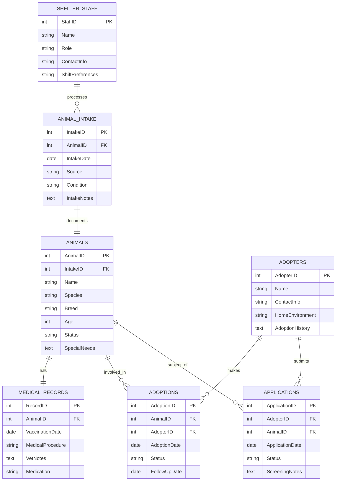
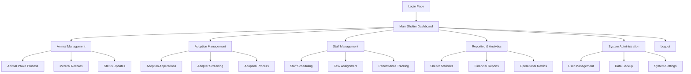

# Animal Shelter Management System - Power Platform Challenge Package

## Project Overview

A comprehensive animal shelter management solution built on Microsoft Power Platform, designed to streamline operations for animal shelters through Power Apps, Power Automate, and Dataverse integration.

**Production Contact:** Mahmoud_abdallah20@learnwithpowerup.onmicrosft.com

## System Architecture

### Entity Relationship Diagram

# Animal Shelter Management System Database Schema




### Dataverse Schema

**Animals Table**
- AnimalID (AutoNumber, Primary Key)
- Name (Text)
- Species (Choice: Dog, Cat, Bird, Other)
- Breed (Text)
- Age (Number)
- IntakeDate (Date)
- Status (Choice: Available, Adopted, Medical Hold, Behavioral Assessment)
- SpecialNeeds (Text)
- Photo (Image)
- Description (Text)

**Shelter Staff Table**
- StaffID (AutoNumber, Primary Key)
- Name (Text)
- Role (Choice: Administrator, Veterinarian, Caretaker, Volunteer Coordinator)
- ContactInfo (Text)
- ShiftPreferences (Text)

**Medical Records Table**
- RecordID (AutoNumber, Primary Key)
- AnimalID (Lookup to Animals)
- ProcedureDate (Date)
- ProcedureType (Choice: Vaccination, Checkup, Surgery, Medication)
- Veterinarian (Lookup to Shelter Staff)
- Notes (Text)
- NextAppointmentDate (Date)

**Adoptions Table**
- AdoptionID (AutoNumber, Primary Key)
- AnimalID (Lookup to Animals)
- AdopterID (Lookup to Adopters)
- AdoptionDate (Date)
- Status (Choice: Pending, Approved, Completed, Denied)
- FollowUpDate (Date)

**Adopters Table**
- AdopterID (AutoNumber, Primary Key)
- Name (Text)
- ContactInfo (Text)
- Address (Text)
- HomeEnvironment (Choice: House, Apartment, Farm)
- PreviousExperience (Text)

**Applications Table**
- ApplicationID (AutoNumber, Primary Key)
- AdopterID (Lookup to Adopters)
- AnimalID (Lookup to Animals)
- ApplicationDate (Date)
- Status (Choice: Submitted, Under Review, Approved, Denied)
- ScreeningNotes (Text)

## System Flowchart



## Power Automate Flow Architecture

### 1. Animal Intake Automation Flow
```
Trigger: New animal intake form submission
Steps:
1. Validate intake data
2. Create animal record in Dataverse
3. Generate unique animal ID
4. Create initial medical record
5. Schedule initial health assessment
6. Notify veterinary staff
7. Update shelter occupancy metrics
```

### 2. Adoption Process Automation Flow
```
Trigger: New adoption application submitted
Steps:
1. Validate application data
2. Check adopter eligibility
3. Assign application to staff reviewer
4. Schedule home visit if required
5. Update application status
6. Notify applicant of status changes
7. Process adoption upon approval
8. Schedule follow-up activities
```

### 3. Medical Reminder System Flow
```
Trigger: Scheduled daily check
Steps:
1. Query animals needing vaccinations
2. Check for upcoming medical appointments
3. Generate reminder notifications
4. Assign tasks to veterinary staff
5. Update medical records after procedures
```

### 4. Reporting Automation Flow
```
Trigger: Scheduled (weekly/monthly)
Steps:
1. Aggregate shelter data
2. Generate performance metrics
3. Create financial reports
4. Distribute reports to stakeholders
5. Archive reports for historical tracking
```

## Power Platform Components

### Power Apps

1. **Animal Management App**
   - Animal intake forms
   - Medical record tracking
   - Status updates
   - Search and filter capabilities

2. **Adoption Portal App**
   - Public-facing application form
   - Available animals gallery
   - Application status tracking

3. **Staff Dashboard App**
   - Animal status overview
   - Task assignments
   - Medical appointment scheduling
   - Reporting capabilities

### Power Automate Flows

1. **New Animal Intake Flow**
   - Trigger: New animal record created
   - Actions: Create medical record, schedule initial vet appointment, notify staff

2. **Adoption Application Processing Flow**
   - Trigger: New application submitted
   - Actions: Background check initiation, staff notification, status updates

3. **Medical Reminder Flow**
   - Trigger: Scheduled based on medical records
   - Actions: Send vaccination reminders, schedule follow-up appointments

4. **Adoption Follow-up Flow**
   - Trigger: Adoption completed
   - Actions: Schedule follow-up checks, send satisfaction surveys

### Power BI Reports

1. **Shelter Analytics Dashboard**
   - Animal intake and adoption rates
   - Shelter capacity monitoring
   - Medical procedure statistics
   - Staff performance metrics

2. **Financial Reports**
   - Adoption fee tracking
   - Donation management
   - Expense reporting

## Implementation Guide

### Environment Setup

1. Create a Power Platform environment
2. Import the solution package
3. Configure connections and permissions
4. Customize forms and views as needed

### Data Migration

1. Prepare existing data in compatible format
2. Use Data Import functionality in Power Apps
3. Validate data integrity after migration

### User Training

1. Admin training for system configuration
2. Staff training for daily operations
3. Volunteer training for limited access functions

## Customization Options

The solution can be customized to accommodate:
- Different animal types and breeds
- Specific medical procedure requirements
- Unique adoption processes
- Local regulatory compliance needs
- Integration with existing systems

## Support and Maintenance

- Regular backup of environment and data
- Monitor flow performance and error rates
- Update with new Power Platform features
- User feedback incorporation

---

*This solution is designed to be flexible and adaptable to various animal shelter operations while maintaining core functionality for animal care and adoption management.*
